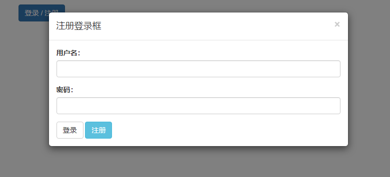
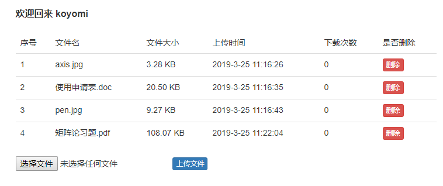
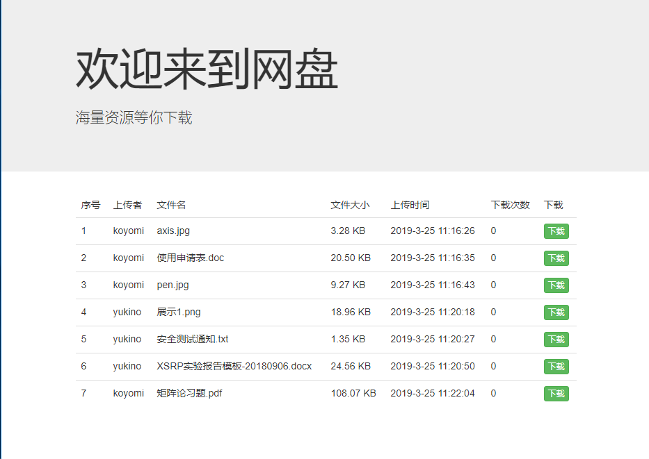
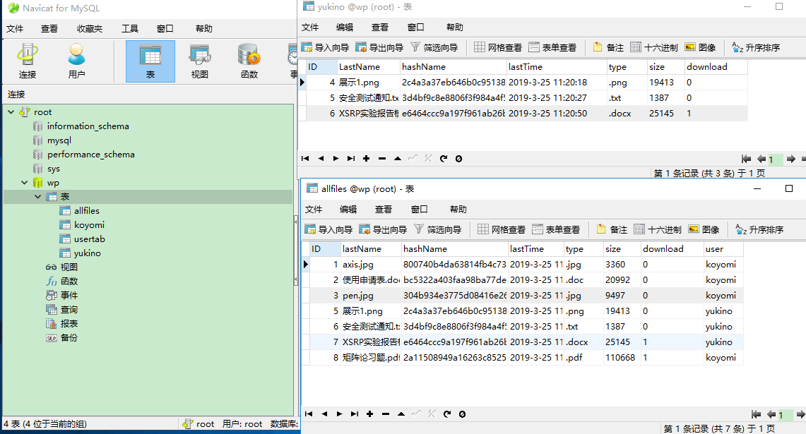

# nodeJs
start to learn node.js, whether I can find a greater world?

---------
## 简易登录注册系统  
**注册成功** -- “恭喜，注册成功”  
**注册重复** -- “该用户名已被注册”  
**登录成功** -- “登录成功”  
**登录名不存在** -- “该用户仍为被注册”  
**密码不符合** -- “用户名或密码错误”  
**发生错误** -- “注册失败”/登录失败  

-----------
## 简易新闻发布系统

### 功能  
 * 能够实现注册账号，用户登录及用户退出
 * 具有发布新闻，查看新闻功能
 * 管理员账号可以将普通用户账号从本地模拟数据库删除
 
 ------------
## 共享网盘

### 工具
 * Express
 * MySql
 * Jquery（仅基本的使用）
 * Bootstrap (较简易)
### 功能
 * 用户个人账号注册、登录
 * 用户上传文件及删除
 * 用户在网盘主页下载文件，对应下载次数更新
 * 对应数据库的增删查改
##
### 展示
  

  

  

---
## 后端接口搭建

### 工具
  * express
  * postman
  * mongoDB Atlas  
  
### 功能
  * 用户的登录注册，token及validate验证，个人头像avatar的获取
  * 个人信息的添加删除，包括基本信息，工作经历，教育经历
  * 点赞及取消点赞，评论及删除评论

